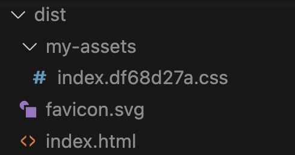

# My fist Astro Site

https://judy-nihao.github.io/first-astro/

`astro.config.mjs` 設定

build 屬性設定的是打包後 dist 資料夾中，負責裝 css 檔案 和 js 檔案的那個資料夾名稱。
預設是 `_astro` 但是一定要改名稱！

我實際遇到的怪現象， 如果用預設的 `_astro` 當資料夾名稱， gh-pages 網站會一直報錯說找不到 css 檔案，即使路徑名稱確認是正確的。

後來把資料夾名稱改成 `my-assets` 才正常抓到 css 檔案。

耗了 1 個小時以上才找到問題點...，照理來說官方的預設命名規則應該不會有問題，但實際上就是遇到了，記錄一下。


```
import { defineConfig } from 'astro/config';

// https://astro.build/config
export default defineConfig({
    site: 'https://judy-nihao.github.io',
    base: '/first-astro',
    build: {
        assets: 'my-assets'
      }
    
});

//  https://judy-nihao.github.io/first-astro

```

